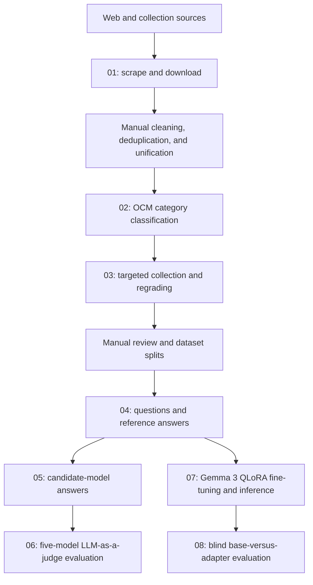

# VLM-Semantics

**A Slovenian benchmark and research pipeline for evaluating cultural-semiotic reasoning in vision-language models.**

[](LICENSE)
[](https://www.python.org/)
[](#important-reproducibility-note)

VLM-Semantics studies whether compact vision-language models (VLMs) can move beyond object recognition and literal description to reason about composition, symbolism, metaphor, intertextuality, intended audiences, and Slovenian cultural meaning. The repository records the main computational stages used to collect and organise images, generate Slovenian questions and reference answers, obtain model responses, evaluate those responses with an LLM judge, and fine-tune Gemma 3 with QLoRA.

The project is intended for researchers working on multimodal evaluation, low-resource languages, cultural grounding, computational semiotics, hallucination analysis, and parameter-efficient adaptation.

## Important reproducibility note

> [!IMPORTANT]
> This repository is a **research record**, not a fully automated one-command pipeline. Several stages of the original experiment involved manual inspection, filtering, merging, renaming, train/test splitting, and moving files between machines. As a result, an output filename from one script does not always exactly match the input filename expected by the next script. Some paths, GPU identifiers, API-key assignments, and experiment names also reflect the machines on which the study was run.
>
> The code is published to show the most important processing, generation, evaluation, and fine-tuning steps as transparently as possible. Before running a stage, inspect its configuration block or command-line arguments and point it to your local copy of the preceding artefact. Do not assume that running the numbered folders in sequence without intervention will reproduce the complete dataset automatically.

The following artefacts are **not** committed to this repository:

- the downloaded image collection;
- manually cleaned and unified metadata files;
- train, validation, and held-out test splits;
- generated reference answers and candidate-model answers;
- judge outputs and aggregate result tables;
- trained LoRA adapter weights.

The included [`00_DATA/ocm-slo-clean.json`](00_DATA/ocm-slo-clean.json) file contains the Slovenian OCM-style taxonomy used by several pipeline stages. It currently has 83 top-level categories.

## Research questions

The pipeline supports four broad questions:

1. How well do compact VLMs answer Slovenian questions that require cultural and semiotic visual reasoning?
2. How do model scale and general Slovenian adaptation affect performance?
3. How closely does an automatic multimodal judge align with human preferences?
4. Can dataset-specific, parameter-efficient supervised fine-tuning improve a strong base model?

## What the benchmark measures

Each retained image is paired with ten Slovenian question types. For each type, one formulation is selected from a bank of ten alternatives.

| Code | Capability | Typical focus |
|---|---|---|
| `SLO` | Slovenian cultural relevance | Meaning for Slovenia, Slovenian identity, or local cultural context |
| `F1` | Salience and visual hierarchy | Main motif, foreground/background, and supporting elements |
| `F2` | Relations between depicted elements | Spatial, narrative, and symbolic relations among objects or people |
| `F3` | Colour and mood | Palette, contrast, atmosphere, and emotional effect |
| `I1` | Composition | Balance, symmetry, visual weight, empty space, and arrangement |
| `I2` | Cultural symbolism | Meaning of a symbol in its cultural, religious, or historical context |
| `I3` | Metaphor | Abstract ideas communicated through visual metaphor or symbolism |
| `A1` | Denotation and connotation | What is literally shown versus what it may signify |
| `A2` | Intertextuality | References to artworks, stories, media, popular culture, or recurring motifs |
| `A3` | Communicative intent | Intended message, purpose, emotional response, and target audience |

The `F`, `I`, and `A` prefixes refer to progressively more interpretive task families; `SLO` separately probes culturally situated Slovenian relevance.

## Experimental scale

The reported held-out experiment initially selected 410 images. One image could not be processed by the automatic judge because the request triggered its safety filter, leaving **409 evaluated images**. With ten questions per image, the final evaluation contains **4,090 image-question tasks** and **20,450 responses** across five VLMs.

The five-model comparison uses:

- `utter-project/EuroVLM-9B-Preview`;
- `google/gemma-3-4b-it`;
- `google/gemma-3-12b-it`;
- `GaMS-Beta/SVILA-1-4B`;
- `GaMS-Beta/SVILA-1-12B`.

The separate fine-tuning experiment starts from `google/gemma-3-12b-it`. The reported run used 34,944 training examples and 3,924 validation examples, with evaluation performed on the same 4,090 held-out tasks.

## Pipeline overview



The manual stages are part of the provenance of the released research code. They are shown explicitly because they explain why filenames and directory layouts differ between some adjacent scripts.

## Repository structure

```text
VLM-semantics/
  00_DATA/
    ocm-slo-clean.json
  01_SCRAP/
    00_scrap_NGS.py
    00_scrap_met.py
    00_scrap_slovenia.py
    00_scrap_vismet.py
    00_scrap_wikicommons_sublink.py
    00_scrap_wikimedia.py
    01_image_download.py
  02_IMAGE_CLASSIFICATION/
    01_image_classification.py
    02_category_count.py
  03_TARGETED_SEARCH/
    01_collect_slo_images_extend.py
    02_regrade_with_gemini3.py
  04_GOLDEN_ANSWERS/
    01_golden_answers.py
  05_MODEL_ANSWERS/
    01_get_answers_gemma.py
    02_get_answers_eurovlm.py
  06_LLM_AS_A_JUDGE/
    01_LLM_as_a_judge.py
  07_FINETUNE/
    01_train_gemma3_12b.py
    02_predict_finetune_gemma3.py
  08_LLM_JUDGE_FINE_TUNE/
    01_gemini_blind_judge_finetune.py
```

## Stage-by-stage guide

### 0. Taxonomy

[`00_DATA/ocm-slo-clean.json`](00_DATA/ocm-slo-clean.json) is a Slovenian hierarchical cultural taxonomy. The classification and targeted-search scripts generally expect it under the shorter name `ocm-slo-clean.json` in the **current working directory**. Copy it, create a symlink, or change the relevant constant before running those scripts.

### 1. Source collection and image download

The collection scripts capture metadata and candidate image URLs from several complementary sources.

| Script | Source | Default output |
|---|---|---|
| [`00_scrap_NGS.py`](01_SCRAP/00_scrap_NGS.py) | National Gallery of Slovenia permanent collection | `ng_stalna_zbirka_structured.json` |
| [`00_scrap_met.py`](01_SCRAP/00_scrap_met.py) | Metropolitan Museum of Art collection pages with images and descriptions | `met_with_desc_images.json` |
| [`00_scrap_slovenia.py`](01_SCRAP/00_scrap_slovenia.py) | Slovenia.si arts and cultural-heritage articles | `slovenia_si_art_kultura.json` |
| [`00_scrap_vismet.py`](01_SCRAP/00_scrap_vismet.py) | VisMet visual-metaphor collection | `vismet.json` |
| [`00_scrap_wikicommons_sublink.py`](01_SCRAP/00_scrap_wikicommons_sublink.py) | Slovenia-related Wikimedia Commons pages discovered from seed terms | `commons_slovenia_sublinks.json` |
| [`00_scrap_wikimedia.py`](01_SCRAP/00_scrap_wikimedia.py) | Media linked from the Wikimedia Commons `Slovenija` page | `commons_slovenija_media.json` |

[`01_image_download.py`](01_SCRAP/01_image_download.py) samples candidate records, downloads successful images into `SLO_images/`, assigns sequential IDs, and writes successful records to `indexed.json`. Edit the configuration block for another source or ID range.

These scripts include retry logic and modest request delays, but source pages can change. Review each source's terms of use, robots policy, copyright conditions, and rate limits before collecting data.

### 2. Image classification and coverage analysis

[`01_image_classification.py`](02_IMAGE_CLASSIFICATION/01_image_classification.py) asks Gemini 2.5 Flash to assign one or more top-level taxonomy categories to each local image. It adds an `ocm_top_categories` list to records.

[`02_category_count.py`](02_IMAGE_CLASSIFICATION/02_category_count.py) counts the multi-label category assignments and writes:

```text
category_representation_outputs/category_representation.xlsx
```


### 3. Targeted search and quality control

[`01_collect_slo_images_extend.py`](03_TARGETED_SEARCH/01_collect_slo_images_extend.py) expands underrepresented taxonomy nodes:

1. Gemini generates Slovenian image-search prompts for a taxonomy node.
2. The script retrieves candidate URLs from Bing Images.
3. Images are downloaded and normalised to JPEG.
4. A locally served `gemma3:27b` model evaluates whether an image matches its category and prompt.
5. Accepted images are written to `SLO_images/`, and provenance is appended to `slo_images_manifest.jsonl`.

The default collection policy generates 25 prompts per node and retains up to two locally judged `good` images per prompt. The JSONL manifest makes the stage resumable and records source URL, local path, taxonomy path, search prompt, label, and rationale.

[`02_regrade_with_gemini3.py`](03_TARGETED_SEARCH/02_regrade_with_gemini3.py) sends locally accepted candidates to Gemini 2.5 Flash for a second quality check. It appends results to `slo_images_manifest_graded.jsonl`, resumes from existing output, and aims for 60 final `good` images per top-level category when the candidate pool permits.

Both scripts contain API-key placeholders in the sanitised repository version. Define them from environment variables before use; see [Known setup points](#known-setup-points).

### 4. Slovenian questions and reference answers

[`01_golden_answers.py`](04_GOLDEN_ANSWERS/01_golden_answers.py) assigns one formulation from each of the ten question families and uses Gemini 2.5 Flash to create Slovenian reference answers. It also records:

- question suitability (`da`, `srednje`, or `ne`) for the nine non-`SLO` questions;
- text-image correlation (`dobro`, `srednje`, or `slabo`);
- generation errors for records that could not be processed.

Questions are processed in five two-question batches, and progress is saved after each image so that an interrupted run can resume.

The filenames use `golden`, but these are **machine-generated silver-standard reference answers**, not independently verified human gold annotations. This distinction matters when interpreting both the evaluation and the fine-tuning targets.

### 5. Candidate-model answer generation

[`01_get_answers_gemma.py`](05_MODEL_ANSWERS/01_get_answers_gemma.py) loads a Gemma 3-compatible checkpoint and deterministically answers every `SLO`, `F*`, `I*`, and `A*` question. The committed `model_id` is `google/gemma-3-4b-it`; during the experiment this value and the output filename were changed manually for Gemma 3 and SVILA variants.

[`02_get_answers_eurovlm.py`](05_MODEL_ANSWERS/02_get_answers_eurovlm.py) performs the corresponding generation with `utter-project/EuroVLM-9B-Preview` through the LLaVA-NeXT processor/model classes.

Both scripts:

- expect `data/golden_final_test.json`;
- replace each `Answer<question-type>` value with the candidate model's answer;
- write model-specific JSON under `out_jsons/`.

The scripts define an optional 4-bit `BitsAndBytesConfig`, but the quantisation argument is commented out in the committed model-loading calls. Enable it only after verifying that your hardware and package versions support the configuration.

### 6. Five-model LLM-as-a-judge evaluation

[`01_LLM_as_a_judge.py`](06_LLM_AS_A_JUDGE/01_LLM_as_a_judge.py) gives Gemini 2.5 Pro the image, Slovenian question, reference answer, and five candidate responses. Every response receives an integer score from 0 to 2 on four dimensions:

| Field | What it measures |
|---|---|
| `fulfilment` | Whether the answer fulfils the task requested by the question |
| `visual_grounding` | Whether claims are tied to specific visible details |
| `explanation` | Whether the interpretation is coherent and supports its claims |
| `hallucination_control` | Whether unsupported visual claims are avoided or uncertainty is marked |

The maximum total is 8. The judge additionally records `major_hallucination` and selects one `best_answer_id` for each image-question task.

The five aliases are fixed in the committed script:

| Alias | Model |
|---|---|
| `model_1` | EuroVLM-9B-Preview |
| `model_2` | Gemma-3-12B-IT |
| `model_3` | Gemma-3-4B-IT |
| `model_4` | SVILA-1-4B |
| `model_5` | SVILA-1-12B |

These are anonymised identifiers in the prompt. The script writes a long-form CSV (`gemini_judge_results_golden_final_test.csv`) and model-specific JSON files with `_with_scores.json` appended.

### 7. Dataset-specific QLoRA fine-tuning

[`01_train_gemma3_12b.py`](07_FINETUNE/01_train_gemma3_12b.py) performs completion-only supervised fine-tuning of `google/gemma-3-12b-it` using 4-bit QLoRA.

The dense base model, visual encoder, multimodal projector, embeddings, and output head remain frozen. LoRA adapters are attached only to language-transformer attention and MLP projections:

```text
q_proj, k_proj, v_proj, o_proj,
gate_proj, up_proj, down_proj
```

Default training settings:

| Setting | Value |
|---|---:|
| Base checkpoint | `google/gemma-3-12b-it` |
| Quantisation | 4-bit NF4 with double quantisation |
| Compute dtype | bfloat16 |
| LoRA rank | 16 |
| LoRA alpha | 32 |
| LoRA dropout | 0.05 |
| Epochs | 1 |
| Per-device batch size | 1 |
| Gradient accumulation | 4 |
| Optimiser | fused AdamW |
| Peak learning rate | `1e-4` |
| Schedule | cosine with 3% warm-up |
| Weight decay | 0.01 |
| Random seed | 42 |
| Sequence packing | disabled |
| Loss | answer/completion tokens only |

By default, the trainer retains only records whose `text_image_correlation` is `dobro`. Pass `--correlations all` to disable this filter. Record the value used in an experiment because it changes the effective training set.

The launcher is specialised for two physical GPUs numbered 5 and 6 and relaunches itself with `torchrun`. Edit `launch_on_gpu_5_and_6()` if your CUDA device numbering differs. The original run used two NVIDIA A100 40 GB GPUs.

[`02_predict_finetune_gemma3.py`](07_FINETUNE/02_predict_finetune_gemma3.py) runs resume-safe, deterministic adapter inference with two independent GPU workers. It creates:

- a wide JSON matching the benchmark record layout; and
- a judge-ready JSONL containing aligned base and fine-tuned responses.

The committed file imports helper functions from `predict_gemma3_testset.py`.

### 8. Blind base-versus-adapter evaluation

[`01_gemini_blind_judge_finetune.py`](08_LLM_JUDGE_FINE_TUNE/01_gemini_blind_judge_finetune.py) compares the unchanged Gemma 3 12B response with the fine-tuned response. Gemini 2.5 Pro sees only `answer_A` and `answer_B`; model identities are not inserted into the prompt.

Candidate positions are assigned deterministically from a fixed seed and balanced across the complete input. The script validates task IDs and fingerprints, appends every successful judgment to a resume-safe JSONL checkpoint, and writes a long-form summary CSV. It uses the same four 0-2 scoring dimensions and major-hallucination flag as the five-model evaluation.

## Input and output hand-offs

The table below makes the non-automated transitions explicit.

| From | Produced by code | Later scripts expect | What happened between stages |
|---|---|---|---|
| Source scrapers | source-specific JSON files | `unified_images_minimal.json` | Records were manually inspected, deduplicated, normalised, and merged. |
| Image downloader | `SLO_images/` and `indexed.json` | `fine_tune_train.json`, `fine_tune_test.json`, and later split files | Images and metadata were reviewed, combined with other sources, and split manually. |
| Included taxonomy | `00_DATA/ocm-slo-clean.json` | usually `ocm-slo-clean.json` in the working directory | The file was copied or its path was changed for individual runs. |
| Reference generation | `golden_final.json` | `data/golden_final_test.json` | A held-out subset was selected and renamed after quality control. |
| Model generation | model-specific JSON under `out_jsons/` | exact filenames listed in `MODEL_FILES` | Files were renamed/organised manually for the five-model judge. |
| Cleaned training records | manually prepared image-question-answer rows | `cleaned_gemma_data_all/train.jsonl` and `validation.jsonl` | Wide image records were expanded to one row per question and split by image. This conversion script is not included. |
| QLoRA training | default `outputs/gemma3-12b-slo-vqa-lora/` | prediction default `outputs/gemma3-12b-slo-all/` | The final experiment used a manually chosen output name. Pass matching paths explicitly. |
| Adapter prediction | wide JSON and judge-ready JSONL | blind-judge `--input-jsonl` | The prediction helper module and generated files are not committed. |

This mismatch is intentional documentation of the historical workflow, not a claim that each intermediate file is generated automatically by the previous script.

## Expected data formats

### Wide benchmark record

A typical wide record contains one image and all ten questions and answers:

```json
{
  "image_id": "123",
  "image_path": "SLO_images/00123.jpg",
  "image_url": "https://source.example/image.jpg",
  "text_image_correlation": "dobro",
  "SLO": "Kaj ta slika pomeni za Slovenijo?",
  "AnswerSLO": "...",
  "F1": "Opiši glavni motiv slike in elemente, ki ga podpirajo v ozadju.",
  "AnswerF1": "...",
  "F1_suitable": "da",
  "F2": "...",
  "AnswerF2": "...",
  "F2_suitable": "srednje"
}
```

The same pattern continues through `F3`, `I1`-`I3`, and `A1`-`A3`.

### Fine-tuning JSONL row

The trainer expects one image-question-answer example per line:

```json
{"image_path":"SLO_images/00123.jpg","question":"...","answer":"...","text_image_correlation":"dobro"}
```

Train and validation splits must be image-disjoint if they are intended to reproduce the experimental design.

### Judge-ready base-versus-adapter row

The blind judge requires the following aligned fields:

```json
{
  "task_id": "123:F1",
  "image_id": "123",
  "image_path": "SLO_images/00123.jpg",
  "question_type": "F1",
  "question": "...",
  "golden_answer": "...",
  "benchmark_answer": "...",
  "finetuned_answer": "..."
}
```

Optional metadata such as `text_image_correlation` and `suitability` is carried through to the summary output.

## Installation

### 1. Clone the repository

```bash
git clone https://github.com/maticmatusek/VLM-semantics.git
cd VLM-semantics
```

### 2. Create an environment

Python 3.10 or newer is required by the type syntax used in the scripts.

```bash
python -m venv .venv
source .venv/bin/activate
python -m pip install --upgrade pip
```

### 3. Install the packages needed for your stage

There is not yet a pinned lock file. A broad environment covering the committed scripts is:

```bash
python -m pip install \
  requests beautifulsoup4 pillow tqdm pandas openpyxl \
  google-genai google-generativeai aiolimiter nest-asyncio \
  torch transformers datasets peft trl accelerate bitsandbytes
```

Install a CUDA-compatible PyTorch build for GPU inference and fine-tuning. `flash-attn` is optional; the QLoRA trainer defaults to PyTorch SDPA.

Model downloads may also require Hugging Face authentication and acceptance of the checkpoint's licence:

```bash
huggingface-cli login
```

### 4. Configure external services

Different historical scripts use different key names or placeholders:

| Service | Used for | Configuration in the committed code |
|---|---|---|
| Google Gemini | classification, prompt generation, reference generation, and judging | `GOOGLE_API_KEY`, `GEMINI_API_KEY`, or an `API_KEY` placeholder depending on the script |
| Ollama | local Gemma 3 27B filtering during targeted collection | `OLLAMA_URL` and `OLLAMA_MODEL` |
| Bing Images | candidate URL discovery | public image-search HTML in the current collector; unused Bing key variables remain in the configuration block |
| Hugging Face Hub | Gemma, SVILA, and EuroVLM checkpoint downloads | local Hugging Face login/token |

For scripts that already read environment variables:

```bash
export GOOGLE_API_KEY="your-key"
export GEMINI_API_KEY="your-key"
export OLLAMA_URL="http://localhost:11434/api/chat"
export OLLAMA_MODEL="gemma3:27b"
```

Do not commit secrets. For scripts with an undefined or empty key placeholder, replace the placeholder locally with an environment lookup such as:

```python
API_KEY = os.environ["GEMINI_API_KEY"]
```

## Running the pipeline

The examples below illustrate the principal entry points. They are not a turnkey reproduction recipe because the manually prepared input files are not distributed.

### Collection

```bash
python 01_SCRAP/00_scrap_NGS.py
python 01_SCRAP/00_scrap_met.py
python 01_SCRAP/00_scrap_slovenia.py
python 01_SCRAP/00_scrap_vismet.py
python 01_SCRAP/00_scrap_wikimedia.py
python 01_SCRAP/00_scrap_wikicommons_sublink.py
python 01_SCRAP/01_image_download.py
```

Outputs are written relative to the current working directory. Change each script's configuration block before a large run.

### Classification and category coverage

After placing the taxonomy and prepared split files at the paths configured in the scripts:

```bash
python 02_IMAGE_CLASSIFICATION/01_image_classification.py
python 02_IMAGE_CLASSIFICATION/02_category_count.py
```

### Targeted collection and second-stage grading

```bash
python 03_TARGETED_SEARCH/01_collect_slo_images_extend.py
python 03_TARGETED_SEARCH/02_regrade_with_gemini3.py
```

The collector expects a reachable Ollama server serving `gemma3:27b`. Test on a small taxonomy subset before a full run because this stage can make many network and model calls.

### Question and reference-answer generation

```bash
python 04_GOLDEN_ANSWERS/01_golden_answers.py
```

Set `INPUT_JSON`, `OUTPUT_JSON`, `MAX_ITEMS`, and the Gemini key before execution.

### Candidate answers

```bash
python 05_MODEL_ANSWERS/01_get_answers_gemma.py
python 05_MODEL_ANSWERS/02_get_answers_eurovlm.py
```

For the Gemma/SVILA script, change `model_id` and `output_json_path` for every checkpoint. Preserve the resulting filenames expected by `MODEL_FILES` in the judge script or update that mapping.

### Five-model judging

```bash
python 06_LLM_AS_A_JUDGE/01_LLM_as_a_judge.py
```

First set `API_KEY`, verify `GOLD_FILE`, `MODEL_FILES`, `IMAGE_ROOT`, and consider a small `MAX_EXAMPLES` smoke test. Judging makes one Gemini request for each image-question task and can incur substantial API cost.

### QLoRA training

The trainer accepts paths as arguments even though its defaults reflect the original machine:

```bash
python 07_FINETUNE/01_train_gemma3_12b.py \
  --train-jsonl /path/to/train.jsonl \
  --validation-jsonl /path/to/validation.jsonl \
  --image-root /path/to/data \
  --output-dir /path/to/outputs/gemma3-12b-slo-all \
  --correlations all
```

Omit `--correlations all` to use the committed default and retain only `dobro` examples. Edit the GPU launcher before running on systems where the intended devices are not physical GPUs 5 and 6.

For a short diagnostic run:

```bash
python 07_FINETUNE/01_train_gemma3_12b.py \
  --train-jsonl /path/to/train.jsonl \
  --validation-jsonl /path/to/validation.jsonl \
  --image-root /path/to/data \
  --output-dir /path/to/outputs/smoke-test \
  --max-steps 50
```

### Adapter inference and blind judging

After restoring the missing prediction helper or adapting the imports:

```bash
python 07_FINETUNE/02_predict_finetune_gemma3.py \
  --benchmark-json /path/to/gemma-3-12b-it_golden_final_test.json \
  --golden-json /path/to/golden_final_test.json \
  --image-root /path/to/data \
  --adapter-dir /path/to/outputs/gemma3-12b-slo-all \
  --output-json /path/to/finetuned_predictions.json \
  --judge-jsonl /path/to/judge_ready.jsonl \
  --gpus 0 1
```

Then run the balanced blind comparison:

```bash
python 08_LLM_JUDGE_FINE_TUNE/01_gemini_blind_judge_finetune.py \
  --input-jsonl /path/to/judge_ready.jsonl \
  --image-root /path/to/data \
  --output-jsonl /path/to/blind_judgments.jsonl \
  --summary-csv /path/to/blind_judgments.csv
```

Both scripts support resume-safe checkpoints. Use `--limit` for a smoke test. Use `--overwrite` only when you intentionally want to replace the output generated by that script.

## Fine-tuning interpretation

QLoRA does not replace or directly update Gemma 3's 12 billion dense parameters. For a pretrained linear transformation `W`, it learns a low-rank correction through two smaller matrices:

```text
W_effective = W + (alpha / r) BA
```

With `r=16` and `alpha=32`, the adapter scale is 2. Approximately 65.5 million LoRA parameters are trainable, or roughly half a percent of the nominal 12B backbone.

Because the vision tower and multimodal projector remain frozen, this experiment primarily tests whether language-side adapters can use existing image features more effectively and produce safer, more task-appropriate Slovenian answers. It does **not** directly train a new visual representation system.

## Headline results from the reported run

These values describe the associated experiment; the raw output files used to calculate them are not included in this repository.

- Gemma-3-12B-IT achieved the strongest aggregate result in the five-model comparison, with a mean rubric score of 5.93 and 2,218 forced best-answer selections.
- In the separate paired QLoRA experiment, the mean score increased from 5.516 to 6.091 across 4,090 held-out tasks.
- Major hallucinations decreased from 25.4% for the unchanged base model to 10.7% for the adapter.
- The adapter received 48.0% of forced best-answer selections. This differs from the mean-score result because the judge had to select one answer even when rubric totals were tied.
- The main gains were in hallucination control, task fulfilment, and explanation. Visual grounding did not improve overall, which is consistent with—but does not prove a causal consequence of—the frozen vision-side architecture.

These findings support a narrow conclusion: dataset-specific QLoRA made the model more reliable and better aligned with the task format, but did not demonstrate a stronger underlying visual encoder.

## Known setup points

Review these items before attempting to run the full workflow:

1. **Manual intermediate files are missing.** Files such as `unified_images_minimal.json`, `fine_tune_train.json`, `golden_final_test.json`, and the JSONL fine-tuning splits were produced through manual cleaning and transformation and are not committed.
2. **Relative paths depend on the working directory.** Most early scripts use bare filenames. Run them from a directory containing the configured inputs or update the paths.
3. **API keys were removed.** Several scripts contain undefined or empty `API_KEY`, `GOOGLE_API_KEY`, or `GEMINI_API_KEY` placeholders. Restore these through environment variables; never paste a real key into a commit.
4. **GPU IDs are machine-specific.** The trainer selects physical GPUs 5 and 6; the prediction script defaults to the same IDs.
5. **Experiment names differ.** The training and inference defaults use different adapter directory names. Always pass the same `--output-dir`/`--adapter-dir` explicitly.
6. **Baseline model selection was manual.** The Gemma answer script was rerun after editing `model_id` and output names for different checkpoints.
7. **External sources and models evolve.** HTML selectors, API behaviour, model revisions, and safety filters may differ from the original run.


```

## Licence

The source code is released under the [MIT License](LICENSE). Third-party datasets, images, webpage content, APIs, model checkpoints, and generated artefacts remain subject to their respective terms and licences.
